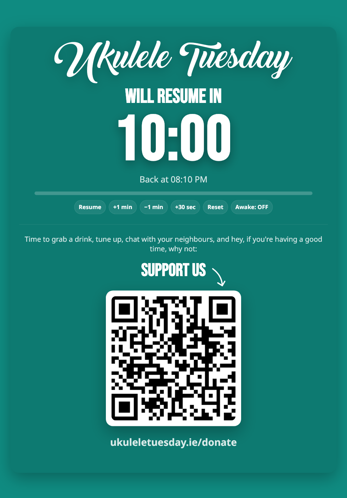

# Ukulele Tuesday Break Timer

A single-file, portrait-first HTML break screen for Ukulele Tuesday that displays a big "will resume in" headline, a giant countdown timer, a progress bar, and a prominent donation call-to-action with QR code for quick mobile scans.

**This web app is meant purely for organisers to display during the break and is not meant to be accessed directly by users/donors.**

## 🚀 Live Demo

**Try it now**: https://ukuleletuesday.github.io/break-page/

The break timer is live on GitHub Pages for immediate access. Bookmark this URL or add it to your home screen for quick access during events!



## Features

### 🎯 **Core Functionality**
- **Giant countdown timer** with MM:SS format and large, projector-friendly display
- **Visual progress bar** showing remaining time
- **Automatic "WE'RE BACK!" state** when timer reaches zero with blinking animation
- **Real-time "Back at" timestamp** showing when the break will end

### 📱 **Touch-Optimized for iPad**
- **Tap anywhere**: Pause/Resume timer
- **On-screen control chips**: Pause, ±1min, +30s, Reset, Wake Lock toggle

### 💰 **Donation Integration**
- **Prominent donate label**
- **QR code generation** for easy mobile scanning (with fallback to text URL)
- **Configurable messaging** for donation appeals and instructions

### 🎨 **Projector & Display Ready**
- **High-contrast design** with #0f8b81 teal background for excellent visibility
- **Portrait-first responsive layout** optimized for tablets and projectors
- **Dark/light theme support** for different lighting conditions
- **Logo display** for branding

### 📵 **PWA Features**
- **Add to Home Screen** support with fullscreen mode
- **Wake Lock API** integration to prevent screen from sleeping during breaks
- **No Safari chrome** when added to home screen on iOS

## Quick Start

### Option 1: Use Live Version
1. **Visit** https://ukuleletuesday.github.io/break-page/ 
2. **Bookmark or add to Home Screen** for quick access
3. **Go fullscreen** (F11) for best projector experience

### Option 2: Download & Host
1. **Download** `index.html` to your device
2. **Open** in any modern web browser
3. **Go fullscreen** (F11) for best projector experience
4. **Add to Home Screen** on iPad for PWA experience

## Configuration

Everything is customizable via URL parameters:

### Timer Settings
- `minutes` or `m` - Total countdown minutes (default: 15)
- `theme` - "dark" (default) or "light"

### Text Content  
- `title` - Main headline (default: "Ukulele Tuesday will resume in")
- `subtitle` - Small text above timer (default: "We're on a short break")
- `headline` - Text above timer (default: "Tip: every €5 prints a songbook")

### Donation Settings
- `ctaText` - Button text (default: "Donate now")  
- `ctaUrl` - Donation link (default: Buy Me a Coffee with UTMs)
- `note` - Text under button (default: "Scan the code or tap the button")

### Display Options
- `qr` - "1" to show QR code, "0" to hide (default: 1)
- `logo` - URL/path to logo image (optional)

### Example URLs

**Basic 10-minute timer:**
```
https://ukuleletuesday.github.io/break-page/?minutes=10
```

**Custom messaging:**
```
https://ukuleletuesday.github.io/break-page/?title=Jazz%20Night%20will%20resume%20in&subtitle=Quick%20intermission&minutes=8
```

**Light theme with custom donation:**
```
https://ukuleletuesday.github.io/break-page/?theme=light&ctaText=Support%20Us&ctaUrl=https://example.com/donate&qr=0
```

**With logo:**
```
https://ukuleletuesday.github.io/break-page/?logo=logo.svg&minutes=12
```

## Usage Tips

### For Organizers
- **Test beforehand** - Try the touch gesture and wake lock on your actual device
- **Bookmark configured URL** - Set up your preferred settings and save the URL
- **Use airplane mode** - Works completely offline (except QR generation uses online service)
- **Keep charger handy** - Wake lock prevents sleep but may drain battery faster

### For Projectors
- **Use fullscreen mode** (F11) for clean display without browser chrome  
- **Dark theme recommended** for better projector contrast
- **Portrait orientation** works best for the layout

### For Mobile/iPad
- **Add to Home Screen** for fullscreen PWA experience
- **Enable Wake Lock** using the on-screen toggle to prevent screen sleep
- **Touch gesture works anywhere** except on interactive elements (buttons, QR code)

## Technical Details

### Browser Support
- **Modern browsers** with ES6+ support (Chrome 65+, Firefox 60+, Safari 12+)
- **Touch events** for mobile gesture support
- **Wake Lock API** for supported browsers (Chrome/Edge 84+)
- **Progressive Web App** features for mobile

### Dependencies
- **Zero dependencies** - Single HTML file with inline CSS and JavaScript
- **QR generation** works completely offline using QRCode.js with local fallback
- **Offline-capable** - Works without internet connection on iPad and other devices

### Architecture
- **Single-file architecture** - Everything in index.html for maximum portability
- **Vanilla JavaScript** - No frameworks or build process required
- **CSS Custom Properties** for theming
- **RequestAnimationFrame** for smooth timer updates
- **Offline QR generation** - Uses QRCode.js (CDN) with embedded fallback for full offline capability

### QR Code Implementation
- **Primary**: QRCode.js loaded from CDN (jsdelivr.net)
- **Fallback**: Embedded minimal QR pattern generator for offline scenarios  
- **URL Encoding**: QR encodes the canonical donation URL (buymeacoffee.com with UTM tracking)
- **Visual Display**: Always shows "ukuleletuesday.ie/donate" text below QR for easy reference
- **Testing**: Playwright tests verify QR payload matches expected canonical URL

## Development

### Visual Regression Testing

This project uses [Playwright](https://playwright.dev/) for visual regression testing. It takes a screenshot of the page and compares it against a baseline snapshot to prevent unintended visual changes. The test dependencies and scripts are managed with `pnpm`.

**Setup**

First, install the dependencies:
```bash
pnpm install
```

**Running Tests**

To execute the visual regression tests:
```bash
pnpm test
```

**Updating Snapshots**

If you make intentional changes to the UI, you will need to update the baseline snapshot. After verifying that the changes are correct, run:
```bash
pnpm playwright test --update-snapshots
```

Commit the updated snapshot file in the `tests/snapshot.spec.ts-snapshots/` directory along with your code changes.

## Deployment

### Static Hosting
Works on any static file host:
- GitHub Pages
- Netlify  
- Vercel
- AWS S3
- Any web server

### Local Usage
- **File:// protocol** works for local testing
- **HTTP server** recommended for PWA features
- **HTTPS required** for Wake Lock API in production

### Customization
1. **Download** index.html
2. **Modify** default values in the JavaScript `defaults` object
3. **Add** your logo file next to index.html
4. **Host** on your preferred platform

## License

This project is open source. Feel free to modify and use for your own events!

## Contributing

This is a simple single-file project. To contribute:
1. Fork the repository
2. Make your changes to `index.html`
3. Test across different devices and browsers
4. Submit a pull request with description of changes
